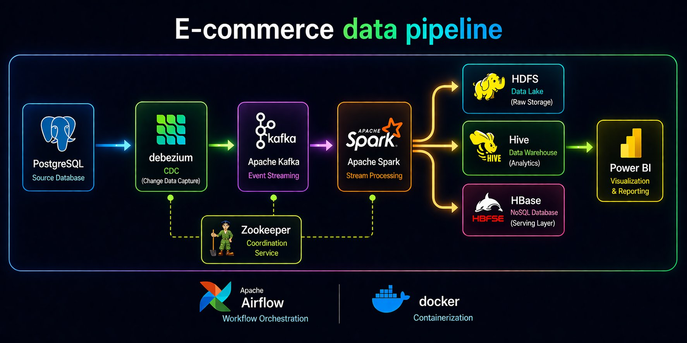
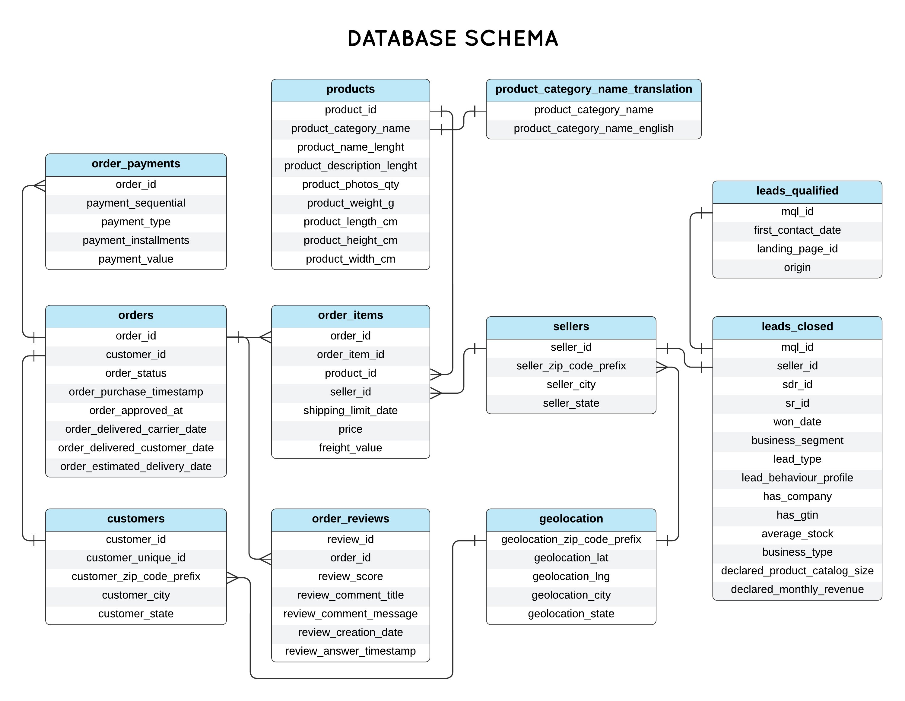
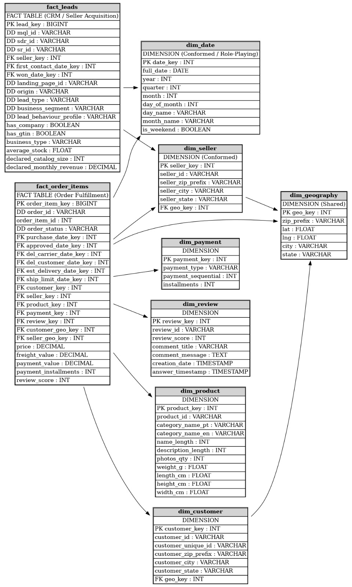

# 🛒 E-Commerce CDC Data Pipeline


A production-grade **Change Data Capture (CDC)** pipeline for e-commerce platforms, built on the **Brazilian E-Commerce (Olist) dataset**. Streams every transactional change from a PostgreSQL OLTP source through **Debezium → Confluent Kafka (Avro + Schema Registry) → Apache Spark**, transforms raw CDC events into a **Star Schema** data warehouse stored in **HDFS / Hive / HBase**, and visualizes results with **Power BI** — fully orchestrated by **Apache Airflow** and containerized with **Docker Compose**.

---

## 📑 Table of Contents

- [Overview](#overview)
- [Pipeline Architecture](#pipeline-architecture)
- [OLTP Source Schema](#oltp-source-schema)
- [Star Schema — After Spark Processing](#star-schema--after-spark-processing)
- [Tech Stack](#tech-stack)
- [Features](#features)
- [Quick Start](#quick-start)
- [Prerequisites](#prerequisites)
- [Installation & Setup](#installation--setup)
- [Configuration](#configuration)
- [Running the Pipeline](#running-the-pipeline)
- [Project Structure](#project-structure)
- [Data Flow](#data-flow)
- [Monitoring & Observability](#monitoring--observability)
- [Testing](#testing)
- [Contributing](#contributing)
- [License](#license)

---

## 📖 Overview

This project ingests real-time transactional changes from a PostgreSQL database modeled on the **Olist Brazilian E-Commerce** dataset. Every `INSERT`, `UPDATE`, and `DELETE` is captured by **Debezium** via WAL logical replication, serialized as **Avro** through the **Confluent Schema Registry**, and streamed via **Apache Kafka**. **Apache Spark Structured Streaming** consumes the events, applies dimensional modeling, and loads the result into a **Star Schema** with two fact tables:

- **`fact_order_items`** — Order fulfillment and sales transactions
- **`fact_leads`** — CRM / seller acquisition pipeline

Final analytical output is served via **Apache Hive** (SQL on HDFS), **HBase** (low-latency lookups), and **Power BI** dashboards.

---

## 🏗️ Pipeline Architecture



> **Flow:** PostgreSQL → Debezium (CDC) → Apache Kafka (Event Streaming) → Apache Spark (Stream Processing) → HDFS (Data Lake) / Hive (Data Warehouse) / HBase (Serving Layer) → Power BI (Visualization)
>
> **Supporting services:** Zookeeper (coordination), Apache Airflow (orchestration), Docker (containerization)

---

## 🗄️ OLTP Source Schema

The PostgreSQL source database is modeled on the **Olist Brazilian E-Commerce** public dataset. It contains 9 normalized tables across order management and seller acquisition domains. Debezium captures row-level changes from all tables via a logical replication slot.



**Debezium-captured Kafka topics per table:**

| Kafka Topic | Source Table | Event Types |
|---|---|---|
| `ecommerce.public.customers` | customers | INSERT, UPDATE, DELETE |
| `ecommerce.public.orders` | orders | INSERT, UPDATE |
| `ecommerce.public.order_items` | order_items | INSERT |
| `ecommerce.public.order_payments` | order_payments | INSERT, UPDATE |
| `ecommerce.public.order_reviews` | order_reviews | INSERT, UPDATE |
| `ecommerce.public.products` | products | INSERT, UPDATE, DELETE |
| `ecommerce.public.sellers` | sellers | INSERT, UPDATE, DELETE |
| `ecommerce.public.geolocation` | geolocation | INSERT, UPDATE |
| `ecommerce.public.leads_qualified` | leads_qualified | INSERT |
| `ecommerce.public.leads_closed` | leads_closed | INSERT, UPDATE |
| `ecom.dlq` | Dead-Letter Queue | Failed / malformed events |

---

## ⭐ Star Schema — After Spark Processing

Apache Spark consumes raw Avro CDC events from Kafka, applies deduplication, type casting, surrogate key generation, and dimensional modeling, then writes two **fact tables** and seven **dimension tables** to Hive (on HDFS) for analytics and HBase for low-latency serving.



**Spark jobs that build the Star Schema:**

| Spark Job | Consumes Topic(s) | Output Table | Notes |
|---|---|---|---|
| `dim_date_job.py` | — (generated) | `dim_date` | Conformed / Role-Playing date dim, run once |
| `dim_customer_job.py` | `ecommerce.public.customers` | `dim_customer` | Includes `geo_key` FK |
| `dim_seller_job.py` | `ecommerce.public.sellers` | `dim_seller` | **Conformed** — shared by both facts |
| `dim_product_job.py` | `products` + `category_translation` | `dim_product` | Joins PT/EN category names |
| `dim_payment_job.py` | `ecommerce.public.order_payments` | `dim_payment` | Payment method & installments |
| `dim_review_job.py` | `ecommerce.public.order_reviews` | `dim_review` | Review scores & timestamps |
| `dim_geography_job.py` | `ecommerce.public.geolocation` | `dim_geography` | **Shared** dim — used by customer & seller |
| `fact_order_items_job.py` | `orders` + `order_items` + all dims | `fact_order_items` | Core sales fact table (Order Fulfillment) |
| `fact_leads_job.py` | `leads_qualified` + `leads_closed` | `fact_leads` | CRM seller acquisition fact table |

---

## 🛠️ Tech Stack

| Layer | Technology | Version | Role |
|---|---|---|---|
| **Source DB** | PostgreSQL (Debezium image) | 15 | OLTP transactional database |
| **CDC Agent** | Debezium PostgreSQL Connector | 2.5.4 | WAL-based row-level change capture |
| **Message Broker** | Confluent Kafka | 7.6.0 | Distributed event streaming |
| **Coordination** | Zookeeper (Confluent) | 7.6.0 | Kafka broker coordination |
| **Schema Registry** | Confluent Schema Registry | 7.6.0 | Avro schema validation & evolution |
| **Connector Runtime** | Confluent Kafka Connect | 7.6.0 | Hosts Debezium plugin |
| **Monitoring UI** | Kafka UI (Provectus) | latest | Topics, consumers, connectors |
| **Stream Processor** | Apache Spark Structured Streaming | 3.5.0 | CDC transformation + Star Schema modeling |
| **Data Lake** | HDFS (Apache Hadoop) | 3 | Raw + curated Parquet storage |
| **Analytics Layer** | Apache Hive | 3.1.3 | SQL query engine on HDFS (Star Schema) |
| **Serving Layer** | Apache HBase | latest | Low-latency key-value lookups |
| **Orchestration** | Apache Airflow | 2.9.0 | DAG-based pipeline scheduling |
| **Visualization** | Power BI | latest | Business dashboards & reporting |
| **Containerization** | Docker Compose | v2 | Full stack orchestration |

---

## 🚀 Quick Start

```bash
# 1. Clone the repository
git clone https://github.com/your-username/ecommerce-cdc-pipeline.git
cd ecommerce-cdc-pipeline

# 2. Configure environment variables
cp .env.example .env

# 3. Start core CDC + Kafka services
docker-compose up -d postgres zookeeper kafka schema-registry kafka-connect kafka-ui

# 4. Wait ~45s for Debezium plugin to install, then register the connector
curl -X POST http://localhost:8083/connectors \
  -H "Content-Type: application/json" \
  -d @connectors/ecommerce-source-connector.json

# 5. Verify CDC events are flowing
docker exec ecom_kafka kafka-console-consumer \
  --bootstrap-server localhost:9092 \
  --topic ecommerce.public.orders \
  --from-beginning

# 6. Open monitoring dashboards
# Kafka UI      → http://localhost:8084
# Schema Reg    → http://localhost:8081/subjects
# Kafka Connect → http://localhost:8083/connectors
```

---


## ✅ Prerequisites

| Tool | Min Version | Notes |
|---|---|---|
| Docker | 24.x | [docs.docker.com](https://docs.docker.com/get-docker/) |
| Docker Compose | 2.x | Bundled with Docker Desktop |
| Git | 2.x | For cloning |
| curl | any | For connector registration |
| RAM | 8 GB+ | Required for full stack |
| Disk | 20 GB+ | Docker images + persistent volumes |


---

**Running containers and ports:**

| Container | Port(s) | Service |
|---|---|---|
| `ecom_postgres` | 5432 | PostgreSQL OLTP source |
| `ecom_zookeeper` | 2181 | Kafka coordination |
| `ecom_kafka` | 9092 | Kafka broker |
| `ecom_schema_registry` | 8081 | Avro Schema Registry |
| `ecom_kafka_connect` | 8083 | Debezium connector runtime |
| `ecom_kafka_ui` | 8084 | Kafka monitoring UI |
| `ecom_spark_master` | 8090, 7077 | Spark master node |
| `ecom_spark_worker` | — | Spark executor |
| `ecom_hdfs_namenode` | 9870, 9000 | HDFS NameNode |
| `ecom_hdfs_datanode` | — | HDFS DataNode |
| `ecom_hive_server` | 10000, 10002 | HiveServer2 |
| `ecom_hbase` | 16010 | HBase Master UI |
| `ecom_airflow_webserver` | 8085 | Airflow UI |

---

### Avro Schemas (`./schemas/`)

```
schemas/
├── customers.avsc
├── orders.avsc
├── order_items.avsc
├── order_payments.avsc
├── order_reviews.avsc
├── products.avsc
├── sellers.avsc
├── geolocation.avsc
├── leads_qualified.avsc
└── leads_closed.avsc
```

---

## ▶️ Running the Pipeline

### Phase 1 — Start Infrastructure

```bash
docker-compose up -d
```

### Phase 2 — Register CDC Connector

```bash
curl -X POST http://localhost:8083/connectors \
  -H "Content-Type: application/json" \
  -d @connectors/ecommerce-source-connector.json

# Confirm RUNNING status
curl -s http://localhost:8083/connectors/ecommerce-postgres-connector/status \
  | python3 -m json.tool
```

### Phase 3 — Submit Spark Jobs

```bash
# Dimension jobs (run once or scheduled by Airflow)
docker exec ecom_spark_master spark-submit \
  --master spark://spark-master:7077 \
  --packages org.apache.spark:spark-sql-kafka-0-10_2.12:3.5.0 \
  /opt/spark-apps/jobs/dim_customer_job.py

# Core fact streaming jobs (continuous)
docker exec ecom_spark_master spark-submit \
  --master spark://spark-master:7077 \
  --packages org.apache.spark:spark-sql-kafka-0-10_2.12:3.5.0 \
  /opt/spark-apps/jobs/fact_order_items_job.py

docker exec ecom_spark_master spark-submit \
  --master spark://spark-master:7077 \
  --packages org.apache.spark:spark-sql-kafka-0-10_2.12:3.5.0 \
  /opt/spark-apps/jobs/fact_leads_job.py
```

### Phase 4 — Enable Airflow DAGs

Access Airflow at [http://localhost:8085](http://localhost:8085) (`admin` / `admin`) and enable:

| DAG | Schedule | Purpose |
|---|---|---|
| `ecommerce_cdc_init` | Once | Register connector, init HDFS, create Hive tables |
| `ecommerce_spark_dims` | `@daily` | Submit dimension refresh jobs |
| `ecommerce_spark_facts` | Continuous | Submit and monitor fact streaming jobs |
| `ecommerce_health_check` | `*/15 * * * *` | Connector status, consumer lag, DLQ alerts |

### Stop Everything

```bash
docker-compose down        # Stop, keep volumes
docker-compose down -v     # Full reset (deletes all data)
```

---

## 📁 Project Structure

```
ecommerce-cdc-pipeline/
│
├── connectors/                          # Debezium connector config
│   └── ecommerce-source-connector.json
│
├── schemas/                             # Avro schemas (one per OLTP table)
│   ├── customers.avsc
│   ├── orders.avsc
│   ├── order_items.avsc
│   ├── order_payments.avsc
│   ├── order_reviews.avsc
│   ├── products.avsc
│   ├── sellers.avsc
│   ├── geolocation.avsc
│   ├── leads_qualified.avsc
│   └── leads_closed.avsc
│
├── init-scripts/
│   └── postgres/                        # Auto-run DDL + seed scripts
│       ├── 01_create_tables.sql
│       ├── 02_seed_data.sql
│       └── 03_replication_setup.sql
│
├── data/                                # Olist CSV dataset files
│   ├── olist_customers_dataset.csv
│   ├── olist_orders_dataset.csv
│   ├── olist_order_items_dataset.csv
│   ├── olist_order_payments_dataset.csv
│   ├── olist_order_reviews_dataset.csv
│   ├── olist_products_dataset.csv
│   ├── olist_sellers_dataset.csv
│   ├── olist_geolocation_dataset.csv
│   ├── olist_marketing_qualified_leads_dataset.csv
│   └── olist_closed_deals_dataset.csv
│
├── spark/
│   ├── jobs/                            # PySpark dimension + fact jobs
│   │   ├── dim_date_job.py
│   │   ├── dim_customer_job.py
│   │   ├── dim_seller_job.py
│   │   ├── dim_product_job.py
│   │   ├── dim_payment_job.py
│   │   ├── dim_review_job.py
│   │   ├── dim_geography_job.py
│   │   ├── fact_order_items_job.py
│   │   └── fact_leads_job.py
│   ├── utils/                           # Shared Avro helpers, key generators
│   └── logs/
│
├── airflow/
│   ├── dags/
│   │   ├── ecommerce_cdc_init.py
│   │   ├── ecommerce_spark_dims.py
│   │   ├── ecommerce_spark_facts.py
│   │   └── ecommerce_health_check.py
│   └── plugins/
│
├── hive/
│   ├── ddl/                             # Star Schema CREATE TABLE statements
│   └── queries/                         # Sample analytics queries
│
├── hbase/
│   ├── schema/                          # HBase table + column family scripts
│   └── api/                             # REST API over HBase
│
├── kafka/
│   ├── config/
│   └── scripts/
│
├── hadoop-config/                       # core-site.xml, hdfs-site.xml
│
├── docs/
│   ├── pipeline-architecture.png        # End-to-end pipeline diagram
│   ├── oltp-schema.png                  # OLTP database schema
│   └── star-schema.png                  # OLAP star schema diagram
│
├── tests/
│   ├── test_spark_jobs.py
│   └── test_connectors.py
│
├── .env.example
├── docker-compose.yml
└── README.md
```

---

## 🔀 Data Flow

```
Step 1 — Transaction
  An e-commerce event occurs in PostgreSQL
  e.g.: customer places order → INSERT into orders + order_items
        │
        ▼
Step 2 — WAL Capture
  PostgreSQL writes the change to its Write-Ahead Log (WAL)
  wal_level=logical + pgoutput plugin enables row-level capture
        │
        ▼
Step 3 — Debezium (Confluent Kafka Connect)
  Reads WAL via logical replication slot "debezium_slot"
  Serializes each change event as Avro against Schema Registry
        │
        ▼
Step 4 — Apache Kafka (Event Streaming)
  Avro CDC event published to topic per table
  e.g.: ecommerce.public.orders
  Zookeeper coordinates broker metadata
  Failed events → ecom.dlq (dead-letter queue)
        │
        ▼
Step 5 — Apache Spark Structured Streaming
  Consumes Kafka topics → deserializes Avro → applies:
    • Deduplication (idempotency on CDC offset)
    • Type casting & null handling
    • Surrogate key generation
    • Dimensional lookups & joins
    • Fact table aggregation
        │
        ├──▶ HDFS      Raw CDC events (Parquet / Avro)
        ├──▶ Hive      Star Schema (dim_* + fact_* tables)
        └──▶ HBase     Serving layer (real-time lookups)
        │
        ▼
Step 6 — Power BI
  Connects to Hive via JDBC
  Dashboards: sales analytics, delivery KPIs, seller funnel, geo maps
        │
        ▼
Step 7 — Apache Airflow (Orchestration)
  DAGs manage every phase: connector registration,
  Spark job submission, health checks, DLQ alerts, dim refresh
```

---

## 📊 Monitoring & Observability

| Tool | URL | Credentials |
|---|---|---|
| **Kafka UI** | http://localhost:8084 | No auth |
| **Schema Registry** | http://localhost:8081/subjects | No auth |
| **Kafka Connect REST** | http://localhost:8083/connectors | No auth |
| **Spark Master UI** | http://localhost:8090 | No auth |
| **HDFS NameNode UI** | http://localhost:9870 | No auth |
| **HBase Master UI** | http://localhost:16010 | No auth |
| **Airflow** | http://localhost:8085 | admin / admin |

### Key Health Check Commands

```bash
# Connector status
curl -s http://localhost:8083/connectors/ecommerce-postgres-connector/status \
  | python3 -m json.tool

# Consumer group lag for Spark jobs
docker exec ecom_kafka kafka-consumer-groups.sh \
  --bootstrap-server localhost:9092 \
  --describe --group spark-cdc-consumer

# List registered Avro schemas
curl http://localhost:8081/subjects

# Inspect dead-letter queue
docker exec ecom_kafka kafka-console-consumer.sh \
  --bootstrap-server localhost:9092 \
  --topic ecom.dlq --from-beginning --max-messages 10

# Check active PostgreSQL replication slots
docker exec ecom_postgres psql -U ecom_user -d ecommerce \
  -c "SELECT slot_name, plugin, active, confirmed_flush_lsn FROM pg_replication_slots;"

# Browse HDFS Star Schema
docker exec ecom_hdfs_namenode hdfs dfs -ls /data/warehouse/
```
